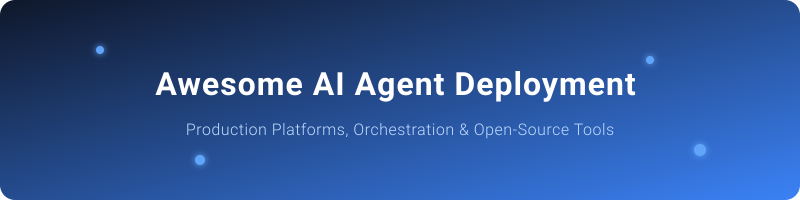

# Awesome-AI-Agent-Deployment-Platform

  
  

## 🚀 Top AI Agent Deployment Platforms Ecosystem
**Curated List of SaaS Products & Open-Source GitHub Projects for AI Agent Orchestration, Deployment, and Management**
*Focused on Building, Deploying, Orchestrating & Observing Production AI Agents*
**Last updated: July 2026**

This repository tracks notable **SaaS platforms** and **open-source projects** for **AI Agent Deployment**. These tools enable multi-agent orchestration, stateful workflows, visual builders, observability, memory management, evaluation, and production-grade deployment of autonomous or collaborative AI agents.

**Examples** include AgentOps, LangGraph Platform (LangSmith Deployment), CrewAI Enterprise, Dify, SuperAGI, Flowise Cloud, Fixie.ai, Stack AI, Letta, and AutoGen Studio (the category leaders).

**Open-source emphasis**: This section is heavily expanded with every major active project for self-hosting, custom agent frameworks, visual builders, memory systems, and observability — ideal for developers, startups, researchers, and enterprises building transparent, controllable agentic systems without vendor lock-in.

Contributions welcome! Open a PR to add/update entries. Keep descriptions factual and link to official sites.

## Table of Contents
- [SaaS/Hosted Platforms](#saas-products)
- [Open-Source GitHub Projects](#open-source-github-projects)
- [How to Contribute](#how-to-contribute)
- [Disclaimer](#disclaimer)

## ☁️ SaaS/Hosted Platforms (Enterprise AI Agents)

### 🎯 Core Platforms (AI Agent Deployment & Orchestration)
- **[AgentOps](https://www.agentops.ai/)**
  Leading developer platform for tracing, debugging, cost tracking, and deploying reliable AI agents with two-line SDK integration across 400+ LLMs and frameworks.
- **[LangGraph Platform / LangSmith Deployment](https://www.langchain.com/)**
  Managed infrastructure for deploying, scaling, and monitoring stateful LangGraph agents with Studio, hybrid/self-hosted options, and deep observability.
- **[CrewAI Enterprise / AMP](https://crewai.com/)**
  Enterprise multi-agent orchestration platform with visual Studio, control plane, connectors, and managed or on-prem (Factory) deployment for production crews.
- **[Dify Cloud](https://dify.ai/)**
  Production LLM app and agent platform with visual workflows, RAG, agent capabilities, and hosted deployment options.
- **[Flowise Cloud](https://flowiseai.com/)**
  Hosted visual builder for LangChain-based agents, chatflows, and multi-agent systems with drag-and-drop interface.
- **[Stack AI](https://www.stackai.com/)**
  No-code/low-code enterprise platform for governed AI workflows, document-heavy agents, and secure app deployment.
- **[Letta Cloud](https://www.letta.com/)**
  Managed platform for stateful agents with advanced long-term memory (formerly MemGPT), self-improving agents, and agent servers.
- **[Fixie.ai](https://fixie.ai/)**
  Platform for building and deploying conversational AI agents and tools with managed runtime.
- **[SuperAGI Cloud](https://superagi.com/)**
  Hosted autonomous agent platform with GUI, toolkits, memory, and marketplace for agent workflows.
- **[AutoGen Studio (Microsoft)](https://microsoft.github.io/autogen/)**
  Low-code interface and managed tooling layered on AutoGen/AG2 for multi-agent conversation systems (research and enterprise Azure paths).

### 🌟 Additional Strong Hosted Options
- **LangSmith** (observability + deployment layer for LangChain/LangGraph ecosystems).
- **CrewAI Factory** (self-managed enterprise deployment of CrewAI on customer VPC/K8s).
- **Various cloud vendor agent runtimes** (AWS Bedrock Agents / AgentCore, Google Vertex AI Agent Builder, Microsoft Copilot Studio / Foundry Agent Service).

## 💻 Open-Source GitHub Projects (Self-Hosted AI Agents)

- **[n8n](https://github.com/n8n-io/n8n)** 
  ](https://github.com/n8n-io/n8n/stargazers)
  ](https://github.com/n8n-io/n8n/stargazers)
  Fair-code workflow automation platform with strong AI/agent nodes, MCP support, and self-hostable orchestration for agentic pipelines.
- **[Langflow](https://github.com/langflow-ai/langflow)** 
  ](https://github.com/langflow-ai/langflow/stargazers)
  ](https://github.com/langflow-ai/langflow/stargazers)
  Visual, low-code platform for building multi-agent and RAG workflows with Python extensibility and self-hosting (MIT).
- **[Dify](https://github.com/langgenius/dify)** 
  ](https://github.com/langgenius/dify/stargazers)
  ](https://github.com/langgenius/dify/stargazers)
  Full open-source LLM application platform with visual workflow builder, RAG pipelines, agent support, and self-hostable production stack (Apache 2.0 with restrictions).
- **[AutoGen / AG2](https://github.com/microsoft/autogen)** 
  ](https://github.com/microsoft/autogen/stargazers)
  ](https://github.com/microsoft/autogen/stargazers)
  Conversational multi-agent framework from Microsoft Research for agent collaboration, debate, and tool use (MIT; evolving into Microsoft Agent Framework paths).
- **[CrewAI](https://github.com/crewAIInc/crewAI)** 
  ](https://github.com/crewAIInc/crewAI/stargazers)
  ](https://github.com/crewAIInc/crewAI/stargazers)
  Role-based multi-agent orchestration framework for collaborative “crews” of specialized agents; lowest barrier to multi-agent systems (MIT).
- **[Flowise](https://github.com/FlowiseAI/Flowise)** 
  ](https://github.com/FlowiseAI/Flowise/stargazers)
  ](https://github.com/FlowiseAI/Flowise/stargazers)
  Open-source low-code visual builder on top of LangChain for drag-and-drop agents, chatflows, RAG, and multi-agent systems (Apache 2.0).
- **[LlamaIndex Agents / Workflows](https://github.com/run-llama/llama_index)** 
  ](https://github.com/run-llama/llama_index/stargazers)
  ](https://github.com/run-llama/llama_index/stargazers)
  Data framework with powerful agent and workflow abstractions, strong RAG + agent combinations, and production patterns.
- **[Agno](https://github.com/agno-agi/agno)** 
  ](https://github.com/agno-agi/agno/stargazers)
  ](https://github.com/agno-agi/agno/stargazers)
  High-performance agent framework and AgentOS runtime focused on multi-agent teams, memory, and production deployment (Apache 2.0).
- **[LangGraph](https://github.com/langchain-ai/langgraph)** 
  ](https://github.com/langchain-ai/langgraph/stargazers)
  ](https://github.com/langchain-ai/langgraph/stargazers)
  Production-grade graph-based framework for building stateful, durable, multi-agent workflows with checkpointing, human-in-the-loop, and streaming (MIT).
- **[smolagents](https://github.com/huggingface/smolagents)** 
  ](https://github.com/huggingface/smolagents/stargazers)
  ](https://github.com/huggingface/smolagents/stargazers)
  Minimal, code-centric agent framework from Hugging Face emphasizing simplicity, code execution, and lightweight orchestration.
- **[Semantic Kernel](https://github.com/microsoft/semantic-kernel)** 
  ](https://github.com/microsoft/semantic-kernel/stargazers)
  ](https://github.com/microsoft/semantic-kernel/stargazers)
  Microsoft open-source SDK for building AI agents and orchestration, especially strong in enterprise/.NET and Azure environments.
- **[AgentScope](https://github.com/agentscope-ai/agentscope)** 
  ](https://github.com/agentscope-ai/agentscope/stargazers)
  ](https://github.com/agentscope-ai/agentscope/stargazers)
  Production-oriented multi-agent framework with actor model, observability, and distributed execution support.
- **[OpenAI Agents SDK](https://github.com/openai/openai-agents-python)** 
  ](https://github.com/openai/openai-agents-python/stargazers)
  ](https://github.com/openai/openai-agents-python/stargazers)
  Lightweight official SDK for building multi-agent workflows with handoffs, tools, and tracing (open source, OpenAI-centric).
- **[Mastra](https://github.com/mastra-ai/mastra)** 
  ](https://github.com/mastra-ai/mastra/stargazers)
  ](https://github.com/mastra-ai/mastra/stargazers)
  TypeScript-native agent framework and workflow engine designed for modern web stacks with strong observability and deployment support.
- **[Letta (formerly MemGPT)](https://github.com/letta-ai/letta)** 
  ](https://github.com/letta-ai/letta/stargazers)
  ](https://github.com/letta-ai/letta/stargazers)
  Open-source framework and server for stateful agents with advanced hierarchical memory management that extends context beyond model limits (Apache 2.0).
- **[Pydantic AI](https://github.com/pydantic/pydantic-ai)** 
  ](https://github.com/pydantic/pydantic-ai/stargazers)
  ](https://github.com/pydantic/pydantic-ai/stargazers)
  Type-safe, structured agent framework built on Pydantic for reliable, production-ready agent development in Python.
- **[SuperAGI](https://github.com/TransformerOptimus/SuperAGI)** 
  ](https://github.com/TransformerOptimus/SuperAGI/stargazers)
  ](https://github.com/TransformerOptimus/SuperAGI/stargazers)
  Open-source autonomous agent platform with GUI, toolkits, memory, agent marketplace, and infrastructure for running multiple agents.
- **[AgentOps SDK](https://github.com/AgentOps-AI/agentops)** 
  ](https://github.com/AgentOps-AI/agentops/stargazers)
  ](https://github.com/AgentOps-AI/agentops/stargazers)
  Open-source observability SDK for tracing, debugging, cost tracking, and replaying AI agent runs across major frameworks.
- **[MetaGPT](https://github.com/geekan/MetaGPT)** 
  ](https://github.com/geekan/MetaGPT/stargazers)
  ](https://github.com/geekan/MetaGPT/stargazers)
  Multi-agent framework that simulates software company roles (PM, architect, engineer, QA) for end-to-end code generation and SOP-driven collaboration.
- **[OpenHands](https://github.com/All-Hands-AI/OpenHands)** 
  ](https://github.com/All-Hands-AI/OpenHands/stargazers)
  ](https://github.com/All-Hands-AI/OpenHands/stargazers)
  Open-source autonomous coding agent platform for software engineering tasks with strong self-hosting and tool use.

### Additional Strong Open-Source Options
- **LangChain** core libraries and ecosystem tools for chains, tools, and agent primitives.
- **Langfuse**, **Phoenix (Arize)**, **Opik**, **Promptfoo**, **DeepEval**, **RAGAS** — open-source observability, tracing, evaluation, and guardrails for agents.
- **Mem0**, **Zep**, and other open memory layers that pair with the frameworks above.
- **MCP (Model Context Protocol)** servers and clients for standardized tool/agent interoperability.
- **kagent** (CNCF) and Kubernetes-native agent runtimes for cloud-native deployment.
- Community **visual builders**, **A2A (agent-to-agent)** protocols, and **self-hosted agent servers**.

**Frameworks for building custom systems**: Combine **LangGraph** or **CrewAI** + **Dify/Flowise/Langflow** for visual layers + **Letta** or **Mem0** for memory + **Langfuse/AgentOps** for observability + **n8n** or Kubernetes for deployment — fully self-hosted production agent platforms.

## 🤝 How to Contribute
1. Fork the repo.
2. Add/edit entries in `README.md` (follow existing format).
3. Include: name, link, 1–2 sentence description, and whether it's SaaS or open-source.
4. Submit PR with a short explanation.

Star the repo if you find it useful!

## 📈 Star History

<a href="https://www.star-history.com/?repos=ishandutta2007%2FAwesome-AI-Agent-Deployment-Platform&type=date&legend=bottom-right">
<picture>
<source media="(prefers-color-scheme: dark)" srcset="https://api.star-history.com/chart?repos=ishandutta2007/Awesome-AI-Agent-Deployment-Platform&type=date&theme=dark&legend=bottom-right" />
<source media="(prefers-color-scheme: light)" srcset="https://api.star-history.com/chart?repos=ishandutta2007/Awesome-AI-Agent-Deployment-Platform&type=date&legend=bottom-right" />

</picture>
</a>

## ⚠️ Disclaimer
- This is a **community-curated** list — not exhaustive and not an endorsement.
- AI agent platforms must comply with relevant regulations, data privacy laws, and organizational security policies.
- Self-hosted open-source solutions require proper security hardening, monitoring, cost controls, and reliability engineering for production use.
---
**Made for AI engineers, platform teams, startups, researchers, and enterprises building agentic systems.**
Let's make AI agent deployment more open, observable, and production-ready.
